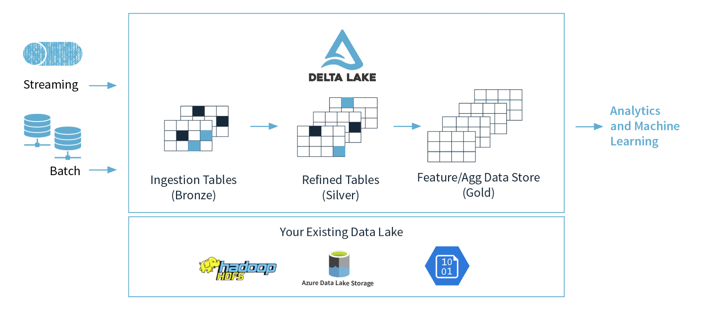
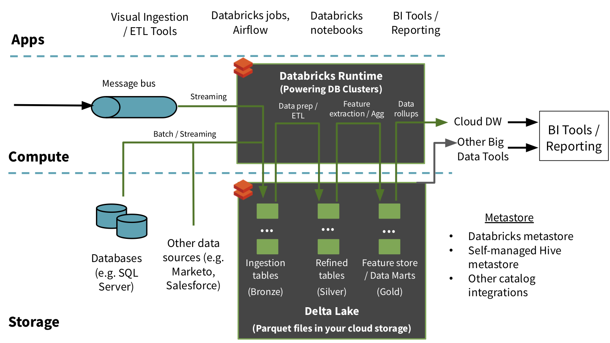

\newpage
# Introduction

Apache Spark is a unified analytics engine for large-scale data processing and machine learning.

The Three V's of Big Data: Volume, Velocity, and Variety.

# Understanding the architecture of spark job

- Spark is distributed computing environment.
- The unit of distribution is a Spark Cluster. 
- Every Cluster has a Driver and one or more executors.
- Work submitted to the Cluster is split into as many independent Jobs as needed - this is how work is distributed across the Cluster's nodes. 
- Jobs are further subdivided into tasks. 
- The input to a job is partitioned into one or more partitions.

{width=60% height=60%}

# Jobs & stages

- Each parallelized action is referred to as a **Job**.
- The results of each Job (parallelized/distributed action) is returned to the Driver.
- Depending on the work required, multiple Jobs will be required.
- Each Job is broken down into **Stages**.
\newpage
# Reading Data 

```{java}
fileName = "dbfs:/mnt/training/wikipedia/clickstream/2015_02_clickstream.tsv"
csvSchema = StructType([
  StructField("prev_id", IntegerType(), False),
  StructField("curr_id", IntegerType(), False),
  StructField("n", IntegerType(), False),
  StructField("prev_title", StringType(), False),
  StructField("curr_title", StringType(), False),
  StructField("type", StringType(), False)
])

testDF = (spark.read          #The DataFrameReader
  .option('header', 'true')   #Ignore line #1 - it's a header
  .option('sep', "\t")        #Use tab delimiter (default is comma-separator)
  .schema(csvSchema)          #Use the specified schema
  .csv(fileName)              #Creates a DataFrame from CSV after reading in the file
)

#Display data
testDF.printSchema()

```
# DataFrames vs SQL & Temporary Views

```{java}
dataDF.createOrReplaceTempView("name_of_db")

#Use simple sql

%sql
SELECT * FROM pagecounts

```

# Convert from SQL back to a `DataFrame`

```{java}
tableDF = spark.sql("SELECT DISTINCT project FROM pagecounts ORDER BY project")
display(tableDF)
```

# Exercise

```{java}

(source, sasEntity, sasToken) = getAzureDataSource()
spark.conf.set(sasEntity, sasToken)

path = source + "/wikipedia/pagecounts/staging_parquet_en_only_clean/"

# 1. Define data frame
#
df = (spark                    # Our SparkSession & Entry Point
  .read                        # Our DataFrameReader
  .parquet(path)               # Read in the parquet files
  .select("article")           # Reduce the columns to just the one
  .distinct()                  # Produce a unique set of values
)
totalArticles = df.count() # Identify the total number of records remaining.

print("Distinct Articles: {0:,}".format(totalArticles))
```

# Describe the difference between eager and lazy execution

Fundamental to Apache Spark are the notions that

- Transformations are LAZY - like creating data - They eventually return another `DataFrame`.
- Actions are EAGER - display data (*touch data*)

**Transformations** applied to `DataFrames` are lazy, meaning they will not trigger any jobs. If you pass the `DataFrame` to a display function, a job will be triggered because display is an action.

## Types of Transformations

- A transformation may be wide or narrow.
- A wide transformation requires sharing data across workers.
- A narrow transformation can be applied per partition/worker with no need to share or shuffle data to other workers.

### Narrow Transformations
The data required to compute the records in a single partition reside in at most one partition of the parent Dataframe.


```{java}
from pyspark.sql.functions import col
display(countsDF.filter(col("NAME").like("%TX%")))
```

### Wide Transformations
The data required to compute the records in a single partition may reside in many partitions of the parent Dataframe. These operations require that data is shuffled between executors.
Wide transformation shares data across workers by shuffling data between executors.

```{java}
from pyspark.sql.functions import col
display(countsDF.groupBy("UNIT").sum("counts"))
```

# Catalyst Optimizer 

Among the most powerful components of Spark are Spark SQL. At its core lies the Catalyst optimizer. This extensible query optimizer supports both rule-based and cost-based optimization.
Spark SQL uses Catalyst's general tree transformation framework in four phases - Analysis, Logical Optimization, Physical Planning, and Code Generation. Our code is evaluated and optimized by the Catalyst Optimizer.


# UnsafeRow (also known as Tungsten Binary Format)

- Sharing data from one worker to another can be a costly operation.
- Spark has optimized this operation by using a format called Tungsten.
- Tungsten prevents the need for expensive serialization and de-serialization of objects in order to get data from one JVM to another.

# DataFrame Column Expressions
## filter(..) & where(..) w/Column


```{java}
filteredDF = (sortedDescDF
  .filter( col("project") == "en")
)
filteredDF.show(10, False)

```

## 1.DateTime-Manipulation

## Data conversion: 


https://docs.oracle.com/javase/tutorial/i18n/format/simpleDateFormat.html 


### `string` to `timestamp`

> `unix_timestamp(..)`

\
```{java}
tempC = (initialDF
  .withColumnRenamed("timestamp", "capturedAt")
  .select( col("*"), unix_timestamp( col("capturedAt"), "yyyy-MM-dd'T'HH:mm:ss").cast("timestamp").alias("capturedAt") )
)
tempC.printSchema()


pageviewsDF = (initialDF
  .withColumnRenamed("timestamp", "capturedAt")
  .withColumn("capturedAt", unix_timestamp( col("capturedAt"), "yyyy-MM-dd'T'HH:mm:ss").cast("timestamp") )
)

```

### year(..), month(..), dayofyear(..)


```{java}
display(
  pageviewsDF
    .select( month( col("capturedAt")) ) # Every record converted to a single column - the month captured
    .distinct()                          # Reduce all months to the list of distinct months
)

(pageviewsDF
  .select( month(col("capturedAt")).alias("month"), year(col("capturedAt")).alias("year"))
  .distinct()
  .show()                     
)

```

### `groupBy()`

Doen't return dataframe. Its $\frac{1}{2}$ of transformation. 

#### Common agregatons:

- `avg()`
- `count()`
- `sum()`
- `min()`
- `max()`
- `mean()`
- `agg()`
- `pivot()`: Pivots a column of the current `DataFrame` and perform the specified aggregation.

```{java}
# rename and aggregate

display(
  pageviewsDF
    .groupBy( col("site") )
    .sum("requests")
    .withColumnRenamed("sum(requests)", "totalRequests")
)
```

### Summary statistics

```{java}
(pageviewsDF
  .filter("site = 'mobile'")
  .select( sum( col("requests")), count(col("requests")), avg(col("requests")), min(col("requests")), max(col("requests")) )
  .show()
)
          
(pageviewsDF
  .filter("site = 'desktop'")
  .select( sum( col("requests")), count(col("requests")), avg(col("requests")), min(col("requests")), max(col("requests")) )
  .show()
)


(pageviewsDF
  .filter("site = 'mobile'")
  .select( 
    format_number(sum(col("requests")), 0).alias("sum"), 
    format_number(count(col("requests")), 0).alias("count"), 
    format_number(avg(col("requests")), 2).alias("avg"), 
    format_number(min(col("requests")), 0).alias("min"), 
    format_number(max(col("requests")), 0).alias("max") 
  )
  .show()
)
```
### Exercie

```{java}
# TODO
from pyspark.sql.functions import upper, col
from pyspark.sql.functions import *

(source, sasEntity, sasToken) = getAzureDataSource()
spark.conf.set(sasEntity, sasToken)

sourceFile = source + "/dataframes/people-with-dups.txt"
destFile = userhome + "/people.parquet"
# In case it already exists
#dbutils.fs.rm(destFile, True)

partitions = 8
df = spark.read.csv(sourceFile, sep=':', inferSchema=True, header=True)

dedupedDF = (df
  .select(col("*"),
      lower(col("firstName")).alias("lcFirstName"),
      lower(col("lastName")).alias("lcLastName"),
      lower(col("middleName")).alias("lcMiddleName"),
      translate(col("ssn"), "-", "").alias("ssnNums")
      # regexp_replace(col("ssn"), "-", "").alias("ssnNums")
      # regexp_replace(col("ssn"), """^(\d{3})(\d{2})(\d{4})$""", "$1-$2-$3").alias("ssnNums")
   )
  .dropDuplicates(["lcFirstName", "lcMiddleName", "lcLastName", "ssnNums", "gender", "birthDate", "salary"])
  .drop("lcFirstName", "lcMiddleName", "lcLastName", "ssnNums")
)
display(dedupedDF)

# ANSWER

# Now we can save the results. We'll also re-read them and count them, just as a final check.
# Just for fun, we'll use the Snappy compression codec. It's not as compact as Gzip, but it's much faster.
(dedupedDF.write
   .mode("overwrite")
   .option("compression", "snappy")
   .parquet(destFile)
)
dedupedDF = spark.read.parquet(destFile)
print("Total Records: {0:,}".format( dedupedDF.count() ))
```
\newpage
# Useful functions

- `initialDF.printSchema()` - show structure
- `df.select( col("a").alias("b")` - rename
- `df.withColumnRenamed("name", "newName")` - rename
- `df.toDF("col1", "col1", "col3")` - rename all following columns.


#  Describe platform architecture, security, and data protection in Azure Databricks

Access control - Folders

- no permissions
- read
- run
- edit
- manage

Access control - Notebooks

- no permissions
- read
- run
- edit
- manage


Access control - Clusters

- can attach to
- can restart
- can manage

Access control - Jobs

- no permissions
- can view
- can manage tun
- is owner
- can manage (admin)

Access control - Tables

- by default all users have access to all data stored in cluster's managed tables, unless administrator enables table access control from that cluster.


View-based access control model defines following privileges:

- select, create, modify, read_metadata, create_named_function, all_privilages.

The privileges can apply to the following classes of objects:

- catalog, database, table, view, function, anonymous_function, any file.

## Secrets

Azure Databricks has two types of secret scopes: Key Vault-backed and Databricks-backed.

As a best practice, instead of directly entering your credentials into a notebook, use Azure Databricks secrets to store your credentials and reference them in notebooks and jobs.

# Azure Blob

- add files to blob, 
- add  access SAS token for container
- Your SAS Token in a production environment should be stored in Secrets/KeyVault to prevent it from being displayed in plain text inside a notebook.

Azure Key Vault is used to Securely store and tightly control access to tokens, passwords, certificates, API keys, and other secrets. 

# Azure Key Vault 

Provides us with a number of options for storing and sharing secrets and keys between Azure applications, and has direct integration with Azure Databricks. 

# Access Azure Databricks Secrets UI

- get your databricks url, and add `#secrets/createScope` it will look like this:

`https://adb-2191932909012589.9.azuredatabricks.net/?o=2191932909012589#secrets/createScope`

## Link Azure Databricks to Key Vault

In the Azure Portal on your Key Vault tab:
1. Go to properties
2. Copy and paste the DNS Name
3. Copy and paste the Resource ID
4. Paste to secret scope.

### List Secret Scopes

To list the existing secret scopes the `dbutils.secrets` utility can be used.

You can list all scopes currently available in your workspace with:

`dbutils.secrets.listScopes()`

- Secrets are not displayed in clear text
- Notice that the value when printed out is [REDACTED]. This is to prevent your secrets from being exposed.

### Facts check

- **The Data Plane** is hosted within the client subscription and is where all data is processed and stored. All data is processed by clusters hosted within the client Azure subscription and data is stored within Azure Blob storage and any connected Azure services within this portion of the platform architecture.
- Data stored in Azure Storage is encrypted using server-side encryption that is seamlessly accessed by Azure Databricks. All data transmitted between the Data Plane and the Control Plane is always encrypted in-flight via TLS.**At-rest and in-transit**
- Commands running on a configured cluster can read and write data in ADLS without configuring service principal credentials. In addition, authentication to ADLS from Azure Databricks clusters is automatic, using the same Azure AD identity one uses to log into Azure Databricks. In addition, authentication to ADLS from Azure Databricks clusters is automatic, using the same Azure AD identity one uses to log into Azure Databricks.
-  **Azure Key Vault-backed secret scope**: A secret scope is provided by Azure Databricks and can be backed by either Databricks or Azure Key Vault. 

# Data Lakes and Delta Lakes

A data lake is a storage repository that inexpensively stores a vast amount of raw data, both current and historical, in native formats such as XML, JSON, CSV, and Parquet

Delta Lake is a file format that can help you build a data lake comprised of one or many tables in Delta Lake format.

Delta Lake makes data ready for analytics.

ACID Transactions:

## Key Concepts: Delta Lake Architecture

We'll touch on this further in future notebooks.

Throughout our Delta Lake discussions, we'll often refer to the concept of Bronze/Silver/Gold tables. These levels refer to the state of data refinement as data flows through a processing pipeline.

These levels are conceptual guidelines, and implemented architectures may have any number of layers with various levels of enrichment. Below are some general ideas about the state of data in each level.

- **Bronze tables**
    - Raw data (or very little processing)
    - Data will be stored in the Delta format (can encode raw bytes as a column)
- **Silver tables**
    - Data that is directly queryable and ready for insights
    - Bad records have been handled, types have been enforced
- **Gold tables**
    - Highly refined views of the data
    - Aggregate tables for BI
    - Feature tables for data scientists
    
## Delta Lake Batch Operations

- read csv -> change to delta

```{java}
df
  .write
  .format("delta")
  .save("/data"`)
```

## CREATE A Table Using Delta Lake

```{java}
spark.sql("""
```

## Metadata

```{java}
DESCRIBE DETAIL customer_data_delta
```

## Delta Lake Batch Operations - Append

```{java}
(newDataDF
  .write
  .format("delta")
  .partitionBy("Country")
  .mode("append")
  .save(DataPath)
)
```

## Delta Lake Batch Operations - Upsert: Insert and Update

```{java}
MERGE INTO customer_data_delta
USING upsert_data
ON customer_data_delta.InvoiceNo = upsert_data.InvoiceNo
  AND customer_data_delta.StockCode = upsert_data.StockCode
WHEN MATCHED THEN
  UPDATE SET *
WHEN NOT MATCHED
  THEN INSERT *
```

# Exercise: Because we stored our data in Delta, our schema and partions are preserved. All we'll need to do is specify the format and the path.

```
deltaDF = (spark.read
           .format("delta")
           .load(DataPath)
           )
```

## Register this Delta table as a Spark SQL table.

```{java}
spark.sql("""
```

## READ updated CSV data

## VACUUM, optimization zeroorder.

```customer_data_delta RETAIN 0 HOURS;```

### Knowledge check

**1. What is the Databricks Delta command to display metadata?**
`DESCRIBE DETAIL tablename`

**2.  How do you perform UPSERT in a Delta dataset?**
`Use MERGE INTO my-table USING data-to-upsert`

**3. What optimization does the following command perform: OPTIMIZE Students ZORDER BY Grade?**

> Ensures that all data backing, for example, Grade=8 is colocated, then rewrites the sorted data into new Parquet files

**4. What size does OPTIMIZE compact small files to?**

Around 1GB

# Azure Databricks structured streaming

- is a fast, scalable
- and fault-tolerant stream processing API. 
- used to perform analytics on your streaming data in near real time.
- possible to use SQL queries to process streaming data in the same way as process static data

# Event Hubs and Spark Structured Streaming

- scalable real-time data ingestion service that processes millions of data in a matter of seconds. 
- can receive large amounts of data from multiple sources and stream the prepared data to Azure Data Lake or Azure Blob storage.
- can be integrated with Spark Structured Streaming to perform processing of messages in near real time.
- possible to query and analyze the processed data as it comes by using a Structured Streaming query and Spark SQL.

# Streaming concepts

**Stream processing** continuously incorporate new data into Data Lake storage and compute results.

- The streaming data comes in faster than it can be consumed when using traditional batch-related processing techniques. 
- **A stream of data** is treated as a table to which data is continuously appended. Examples of such data:
    - include bank card transactions
    - Internet of Things (IoT) device data
    - video game play events.

**A streaming system** consists of:
- Input sources such as Kafka, 
- Azure Event Hubs,
- IoT Hub, files on a distributed system,
- TCP-IP sockets
- Stream processing using Structured Streaming
- forEach sinks
- memory sinks, etc.

Sorting is one of a handful of operations that is either too complex or logically not possible to do with a stream.
**Triggers**: The trigger specifies when the system should process the next set of data.

### Check 
**Q: What do readStream and writeStream do?**
A: readStream creates a streaming DataFrame.
writeStream sends streaming data to a directory or other type of output sink.

**Q: What does display output if it is applied to a DataFrame created via readStream?**
A: display sends streaming data to a LIVE graph!

**Q: When you do a write stream command, what does this option do outputMode("append") ?**
A: This option takes on the following values and their respective meanings:

- append: add only new records to output sink
- complete: rewrite full output - applicable to aggregations operations
- update: update changed records in place

**Q: What happens if you do not specify option("checkpointLocation", pointer-to-checkpoint directory)?**
A: When the streaming job stops, you lose all state around your streaming job and upon restart, you start from scratch.

**Q: How do you view the list of active streams?**
A: Invoke spark.streams.active.

**Q: How do you verify whether streamingQuery is running (boolean output)?**
A: Invoke spark.streams.get(streamingQuery.id).isActive.

## Event Time vs Receipt Time

**Event Time** is the time at which the event occurred in the real world.

**Event Time is NOT** something maintained by the Structured Streaming framework.

At best, Structured Streaming only knows about **Receipt Time** - the time a piece of data arrived in Spark.

**Watermarking**

A better solution to the problem is to define a cut-off.

A point after which Structured Streaming will commit windowed data to sink, or throw it away if the sink is console or memory as display() mimics.

That's what watermarking allows us to do.

# Structured Streaming with Azure EventHubs 
Microsoft Azure Event Hubs is a fully managed, real-time data ingestion service. You can stream millions of events per second from any source to build dynamic data pipelines and immediately respond to business challenges. It integrates seamlessly with a host of other Azure services.

## Event Hubs can be used in a variety of applications such as

- Anomaly detection (fraud/outliers)
- Application logging
- Analytics pipelines, such as clickstreams
- Archiving data
- Transaction processing
- User telemetry processing
- Device telemetry streaming
- Live dashboarding

## Quiz

**1. When doing a write stream command, what does the outputMode("append") option do?**

- The append mode allows records to be updated and changed in place

- **The append outputMode allows records to be added to the output sink**
*The outputMode "append" option informs the write stream to add only new records to the output sink. The "complete" option is to rewrite the full output - applicable to aggregations operations. Finally, the "update" option is for updating changed records in place.*

- The append mode replaces existing records and updates aggregates
\

**2. In Spark Structured Streaming, what method should be used to read streaming data into a DataFrame?**

- **spark.readStream**
*Use the spark.readStream method to start reading data from a streaming query into a DataFrame.*

- spark.read

- spark.stream.read
\

**3. What happens if the command option("checkpointLocation", pointer-to-checkpoint directory) is not specified?**

- It will not be possible to create more than one streaming query that uses the same streaming source since they will conflict

- The streaming job will function as expected since the checkpointLocation option does not exist

- **When the streaming job stops, all state around the streaming job is lost, and upon restart, the job must start from scratch**
*Setting the checkpointLocation is required for many sinks used in Structured Streaming. For those sinks where this setting is optional, keep in mind that when you do not set this value, you risk losing your place in the stream.*

# Describe Azure Databricks Delta Lake architecture
{width=60% height=60%}

An example of a Delta Lake Architecture might be as shown in the diagram above.

- Many devices generate data across different ingestion paths.
- Streaming data can be ingested from IOT Hub or Event Hub.
- Batch data can be ingested by Azure Data Factory or Azure Databricks.
- Extracted, Transformed data is loaded into a **Delta Lake**.

## Lambda architecture

Big data generates time consuming queries, thus results might not be up-to-date (Query can take some hours, results are not in real time -> loss in accuracy)

**Lambda architecture** architecture that combines both batch- and real-time processing methods. Time-stamped events are appended to existing events, and nothing is overwritten. 

{width=60% height=60%}

## Delta Lake architecture

**Delta Lake**  At each stage, we enrich our data through a unified pipeline that allows us to combine batch and streaming workflows through a shared filestore with ACID-compliant transactions.

- **Bronze tables** contain raw data ingested from various sources (JSON files, RDBMS data, IoT data, etc.).

- **Silver tables** will provide a more refined view of our data. We can join fields from various bronze tables to enrich streaming records, or update account statuses based on recent activity.

- **Gold tables** provide business level aggregates often used for reporting and dashboarding. This would include aggregations such as daily active website users, weekly sales per store, or gross revenue per quarter by department.

{width=60% height=60%}

# Unifying Structured Streaming with Batch Jobs with Delta Lake

## General Notation
Format to write a streaming job to a Delta Lake table.


```{java}
(myDF
  .writeStream
  .format("delta")
  .option("checkpointLocation", checkpointPath)
  .outputMode("append")
  .start(path)
  
# Output mode
##- append: add only new records to output sink
##- complete: rewrite full output - applicable to aggregations operations
)
```

## Create QUERY tables (aka "silver tables")
In order to parse the data in human-readable form, create query/silver tables out of the raw data.

Stream from  previous file write, define transformations, and rewrite data to disk.

### See list of active streams

```{code}
for s in spark.streams.active:
  print(s.id)

```


## CREATE A Table Using Delta Lake

```{java}
spark.sql("""
  DROP TABLE IF EXISTS grouped_count
""")
spark.sql("""
  CREATE TABLE grouped_count
  USING DELTA
  LOCATION '{}'
""".format(groupedCountPath))
```

When using complete output mode, we rewrite the entire state of our table each time our logic runs. While this is ideal for calculating aggregates, we cannot read a stream from this directory, as Structured Streaming assumes data is only being appended in the upstream logic.

### Summary:
Delta Lake is ideally suited for use in streaming data lake contexts.

Use the Delta Lake architecture to craft raw, query, and summary tables to produce beautiful visualizations of key business metrics.

## Quiz

**1. What is a lambda architecture and what does it try to solve?**

- An architecture that defines a data processing pipeline whereby microservices act as compute resources for efficient large-scale data processing

- **An architecture that splits incoming data into two paths - a batch path and a streaming path. This architecture helps address the need to provide real-time processing in addition to slower batch computations.**
*Correct. The lambda architecture is a big data processing architecture that combines both batch- and real-time processing methods.*

- An architecture that employs the latest Scala runtimes in one or more Databricks clusters to provide the most efficient data processing platform available today

**2. What command should be issued to view the list of active streams?**

- **Invoke spark.streams.active**
*That's the correct syntax to view the list of active streams.*

- Invoke spark.streams.show

- Invoke spark.view.active

**3. What is required to specify the location of a checkpoint directory when defining a Delta Lake streaming query?**

- .writeStream.format("delta").checkpoint("location", checkpointPath) ...

- **.writeStream.format("delta").option("checkpointLocation", checkpointPath) ...**
*That's the correct syntax to specify the checkpoint directory on a Delta Lake streaming query.*


- .writeStream.format("parquet").option("checkpointLocation", checkpointPath) ...


### Additional Topics & Resources

* [Delta Streaming Write Notation](https://docs.databricks.com/delta/delta-streaming.html#as-a-sink)
* [Structured Streaming Programming Guide](href="https://spark.apache.org/docs/latest/structured-streaming-programming-guide.html)
* [This is an excellent video describing how Structured Streaming works](https://www.youtube.com/watch?v=rl8dIzTpxrI)
* [Lambda Architecture](http://lambda-architecture.net/)
* [Data Warehouse Models](https://bennyaustin.wordpress.com/2010/05/02/kimball-and-inmon-dw-models/)
* [Reading structured streams from Kafka](https://people.apache.org//~pwendell/spark-nightly/spark-branch-2.1-docs/latest/structured-streaming-kafka-integration.html)
* [Create a Kafka Source Stream](http://spark.apache.org/docs/latest/structured-streaming-kafka-integration.html#creating-a-kafka-source-stream)
* [Multi Hop Pipelines](https://docs.databricks.com/delta/delta-intro.html#case-study-multi-hop-pipelines)


# Create production workloads on Azure Databricks with Azure Data Factory

## Schedule Databricks jobs in a data factory pipeline

ETL: extract, transform, load.

Azure Data Factory, you can create and schedule data-driven workflows (*pipelines*) that can ingest data from disparate data store. 

*A pipeline* is a logical grouping of activities that together perform a task.

### Quiz
1. What's the purpose of linked services in Azure Data Factory?

- **To represent a data store or a compute resource that can host execution of an activity**
*Correct. Linked services define the connection information needed for Data Factory to connect to external resources.*

- To represent a processing step in a pipeline

- To link data stores or computer resources together for the movement of data between resources

2. How can parameters be passed into an Azure Databricks notebook from Azure Data Factory?

- Use the new API endpoint option on a notebook in Databricks and provide the parameter name

- **Use notebook widgets to define parameters that can be passed into the notebook**
*Correct. You can configure parameters by using widgets on the Databricks notebook. You then pass in parameters with those names via a Databricks notebook activity in Data Factory.*

- Deploy the notebook as a web service in Databricks, defining parameter names and types


3. What happens to Databricks activities (notebook, JAR, Python) in Azure Data Factory if the target cluster in Azure Databricks isn't running when the cluster is called by Data Factory?

- **If the target cluster is stopped, Databricks will start the cluster before attempting to execute**
*This situation will result in a longer execution time because the cluster must start, but the activity will still execute as expected.*

- The Databricks activity will fail in Azure Data Factory – you must always have the cluster running

- Simply add a Databricks cluster start activity before the notebook, JAR, or Python Databricks activity
